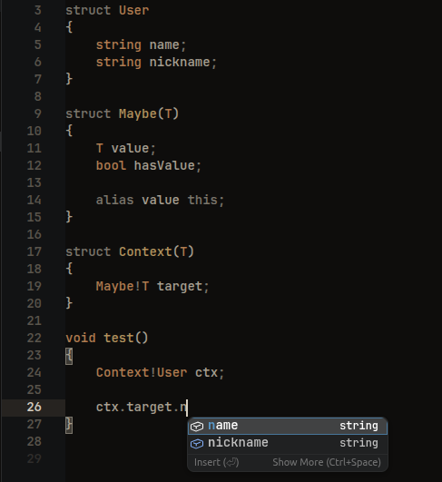

# dls

**dls** is a language server for the [D programming
language](https://dlang.org/), built on a fork of
[DCD](https://github.com/dlang-community/DCD).

> **Work in progress.**




# Build

```
make                 # debug
make MODE=RELEASE    # optimized
```

The default compiler is `ldmd2` (LDC's dmd-compatible driver);
override it with `make DC=<driver>`.


You can find pre-built binaries from the [nightly release](https://github.com/xoxorwr/dls/releases/tag/nightly).


# Tests


```
make test                       # to build & run the full suite
python run_tests.py             # to manually invoke the suite
python run_tests.py -k hover    # filter by test id
python run_tests.py --list      # show what would run
```

# Editors

Create a `dls.json` at the root of your project:

```json5
{
    "importPaths": [
        "src/",                 // relative to the workspace root
        "/home/you/project_b/", // or absolute
    ],
}
```

Without it the server still works, with only the compiler's default
import paths registered.


- VSCode: `make build-vscode`.  Point `dls.serverPath` at the binary, or let
  the extension download one; the `dls.createConfig` command writes a starter
  `dls.json`.
- Sublime Text: install sublime's LSP extension.
```json5
    "dls": {
        "enabled": true,
        "command": ["/where/is/dls"],
        "selector": "source.d",
    },
```

- Zed: Extensions -> Install Dev Extension, point to `editors/zed/`.
